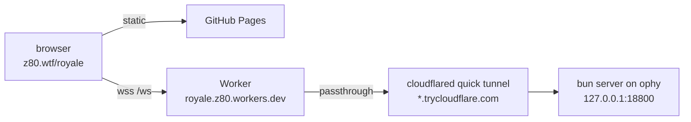

# LAUNCHPAD ROYALE

Browser multiplayer top-down battle royale starring the crypto launchpad world — Doppler, Uniswap, Pons, Long, Jump, Fomo, Pump, Clanker, Zora, Bankr. Bots fill empty slots. Not financial advice.

**Play: https://z80.wtf/royale** — open the link, pick a brand, hit **READY**. Once anyone is ready a 45 s
auto-launch timer starts; if every human in the lobby is ready it launches immediately. Everyone in the lobby plays
(ready or not), bots fill the rest. Arrive mid-match and you spectate, then play the next game. The first human in the
lobby is host (team size solo → sixes, bot fill count, bot skill, force start). Dropped connections resume your seat
for 90 s.

## Production setup



- **Frontend**: `.github/workflows/pages.yml` runs `bun run build:pages` (bakes in `wss://royale.z80.workers.dev/ws`)
  and publishes `public/` on every push to `main`. `?server=wss://…/ws` overrides the backend for testing.
- **Worker** (`deploy/worker`): stable front door. The backend registers its current quick-tunnel origin with
  `POST /register` (bearer `REGISTER_SECRET`, stored in KV); `/ws` and `/health` are passed through to it.
  Deploy: `cd deploy/worker && bunx wrangler deploy`.
- **Backend on ophy** (`~/services/royale`): systemd `royale.service` (game server) and `royale-tunnel.service`
  (`deploy/ophy/tunnel.ts`: runs the quick tunnel, registers it, health-checks it and restarts on failure). The
  register secret lives in `~/services/royale/.env` (`ROYALE_REGISTER_SECRET=…`). Update after pushing:
  `ssh ophy '~/services/royale/deploy/ophy/update.sh'` (restarting the server ends a live match).
- Logs: `ssh ophy 'journalctl -u royale -u royale-tunnel -f'`.

## Local play / dev

```sh
bun install
bun run start        # builds the client, serves http://localhost:3000 (+ LAN URL printed)
bun run tunnel       # optional, second terminal: public https URL via cloudflared quick tunnel
```

Dev loop: `bun run dev` (client rebuild on save + server restart on save).

Server env knobs: `PORT` (default 3000), `HOST` (default 0.0.0.0), `LR_FAST=1` compresses every phase timer, zone
wait/shrink and airdrop time by ×0.2 for quick test rounds (`LR_FAST=0.5` etc. sets the scale directly). The server
logs each match's average/max tick cost when it ends.

Renderer quality: starts high and steps down automatically if fps sags; lock it with `?quality=0|1|2` in the URL.
Renderer lab (no server needed): `bun build client/render/preview.ts --outdir public/dist --target browser`, then open
`/preview.html`.

## Brands & abilities (Q)

| Brand | Ability |
| --- | --- |
| Doppler | Doppler Shift — blink toward aim, sonic boom slows enemies |
| Uniswap | Liquidity Pool — healing pool for allies |
| Pons | Family Radar — reveal enemies to your team |
| Long | Long Position — +45% damage |
| Jump | Send It — leap over walls, landing shockwave |
| Fomo | FOMO Rush — speed + fire rate for you and nearby allies |
| Pump | Pump & Dump — lobbed bomb |
| Clanker | Deploy Clanker — auto turret |
| Zora | Orb Shield — bullet-blocking dome |
| Bankr | Vault Mode — instant armor + brief invulnerability |

Everyone lands at the same moment and gets ~3 s of "market opens" grace before weapons go hot. Bot skill: Paper Hands
(casual), Degen (default), Whale (sweaty).

## Audio

All sound effects and the synthwave music are synthesized at runtime with WebAudio — no audio files. Master volume
lives in the settings gear (persisted per browser).

## Controls

| Key | Action |
| --- | --- |
| WASD / mouse | move / aim |
| LMB | fire |
| Space / Shift | dash |
| Q | brand ability (aimed at cursor) |
| E | pick up weapon / open Treasury chest |
| R | reload |
| 1 / 2, wheel | weapon slots |
| 3 / 4 | Stablecoin (+25 HP) / Cold Wallet (full heal) |
| X | drop weapon |
| 5–0 | emotes |
| Tab | scoreboard |
| M | big map |
| Enter | chat (`gm`, `/wen`, `/help`) |
| F | toggle ready (lobby, results, spectating) |
| ←/→ or A/D | cycle spectate while dead |

## Layout

- `shared/` — contracts used by both sides: constants (characters, weapons, zone), deterministic map generator, physics/movement (client prediction == server sim), wire protocol.
- `server/` — Bun HTTP + WebSocket server, authoritative 30 Hz simulation, bots.
- `client/` — `main.ts` entry, net/prediction/interpolation, WebAudio synth, `render/` (Three.js), `ui/` (DOM HUD).
- `public/` — static assets; `badges/` are normalized brand badges built from the real marks in `logos/`.
